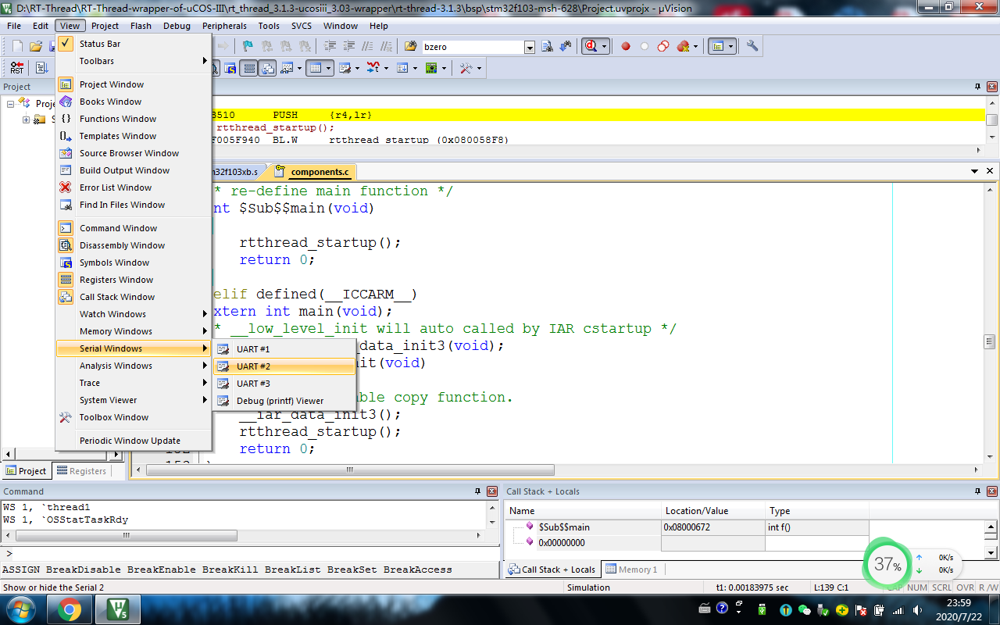
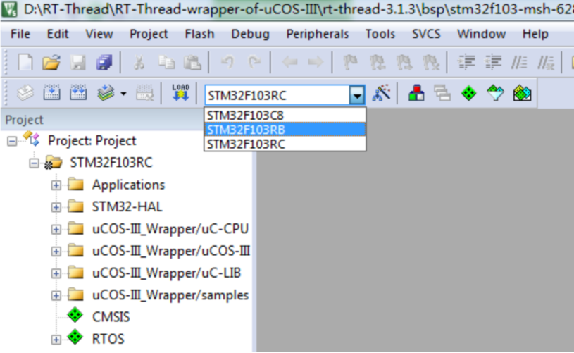
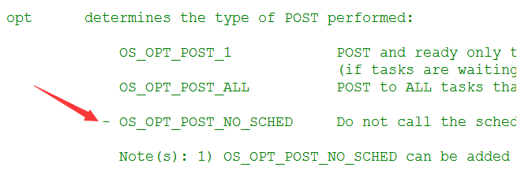
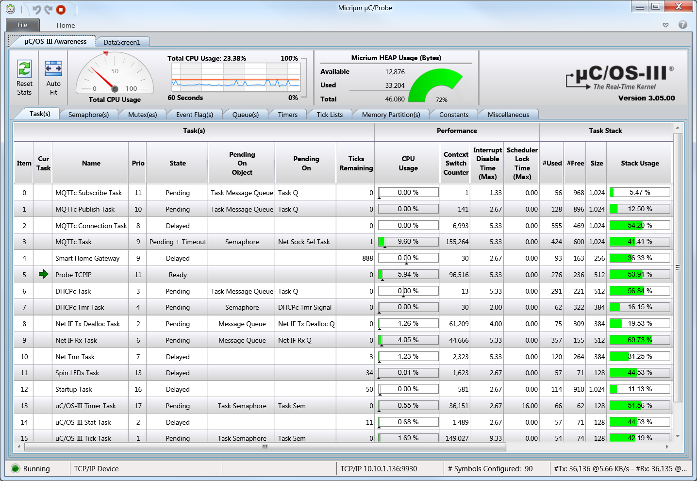
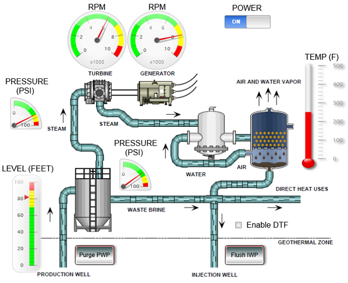

# RT-Thread操作系统的μC/OS-III兼容层
## 让基于μC/OS-III开发的应用层无感地迁移到RT-Thread操作系统

[TOC]


------

# 0 前排提示

本文含有图片，受限于**中国大陆互联网环境**，访问github时，**readme.md(本文件)的图片一般加载不出来**，因此我导出了.html文件。如果您需要详细阅读，可以将项目下载或clone下来，阅读**wiki_CN.html**文件。

**如果你喜欢本项目，请点击右上角的Star予以支持，谢谢！**


# 1 概述

这是一个针对RT-Thread国产操作系统的μCOS-III操作系统兼容层，可以让基于美国Micriμm公司的μCOS-III操作系统的项目快速、无感地迁移到RT-Thread操作系统上。在兼容层的设计、编写上尊重原版μC/OS-III，保证原版μC/OS-III的原汁原味。

支持版本：μC/OS-III 3.00-3.08全部版本

## 1.1 本兼容层适合于：

- 之前学习过μCOS-III操作系统，意图转向学习RT-Thread国产操作系统。本兼容层可以帮您用已有的μCOS-III编程经验和习惯快速将项目跑起来，日后在应用过程中深入熟悉RT-Thread的API函数，逐步向RT-Thread过度，降低您的学习门槛和时间成本。**有了本兼容层，对RT-Thread API以及编程风格的不熟悉再也不是您学习RT-Thread的阻力！**

- 现有任务（线程）模块采用μCOS-III编写，想要用在基于RT-Thread的工程上

- 老项目需要从μCOS-III操作系统向RT-Thread操作系统迁移

- 当需要快速基于RT-Thread开发产品，但是工程师之前均采用μC/OS开发，从未用过RT-Thread的开发经验。本兼容层可以帮助让工程师快速基于μC/OS开发经验开发产品，简化软件的重用、缩短微控制器新开发人员的学习过程，并缩短新设备的上市时间。

- 避免在从μCOS-III迁移到RT-Thread时，由于μCOS-III的编程经验导致的思维定式引发的错误，这种错误一般很难被发现 
  
     > ​    例如：
     >
     > 1. 两个操作系统对于任务/线程挂起、解挂函数的区别。   
     > RT-Thread不支持任务嵌套挂起、解挂   
     > ​μCOS-III支持任务嵌套挂起、解挂
     >
     > 2. 软件定时器参数的不同
     >
     > 3. 任务堆栈的数据类型不同
     
- 本兼容层实现了与Micriμm公司专门为其旗下产品μC/OS等开发的专用软件μC/Probe的对接，可以通过该软件以图像化形式查看、调试RT-Thread内核以及μCOS-III兼容层的相关信息


## 1.2 版本详细信息
|    组件名称    | 版本号  |                   说明                    |
| :------------: | :-----: | :---------------------------------------: |
| RT-Thread nano |  3.1.3  |                                           |
|   μC/OS-III    | 3.03.00 | 兼容层兼容3.00.00-3.08.00全部μCOS-III版本 |
|     μC/CPU     | 1.30.00 |                                           |
|     μC/LIB     | 1.39.00 |           兼容层完整兼容μC/LIB            |


## 1.3 官网

RT-Thread：https://www.rt-thread.org/   
文档中心：https://www.rt-thread.org/document/site/tutorial/nano/an0038-nano-introduction/

μCOS-III：https://www.micrium.com/  
文档中心：https://doc.micrium.com/display/kernel304/uC-OS-III+Documentation+Home


# 2 使用

## 2.1 Keil-MDK仿真工程
本仿真工程是基于STM32F103平台。

Keil工程路径：*<u>rt-thread-3.1.3/bsp/stm32f103/Project.uvprojx</u>*

需要提前安装好RT-Thread Nano-3.1.3 Keil支持包：https://www.rt-thread.org/download/mdk/RealThread.RT-Thread.3.1.3.pack

**注意：调试串口使用的是USART2，不是USART1**




目前仿真工程支持以下型号：

- STM32F103C8
- STM32F103RB
- STM32F103RC

上述型号可以通过如图所示方式进行切换。




## 2.2 迁移步骤
1. 将**uCOS-III_Wrapper**文件夹内的所有文件都加入到你的工程中，最好保持原有文件夹的结构。相较于原版μCOS-III增加了`os_rtwrap.c`文件，负责对RT-Thread和μCOS-III的转换提供支持。
2. 浏览一下`μC-CPU/cpu.h`文件，看一下头文件中的定义是否符合你的CPU，一般不需要改这个文件
3. 浏览一下`μCOS-III/os.h`文件，看一下错误代码，这个错误代码和原版μCOS-III是有一定区别的。  
   **注意: 请勿随意打开注释掉的错误码枚举体成员，** 如果用户使用到了这些注释掉的成员,则会在迁移时编译报错,用以提醒用户这些错误代码在兼容层已经不可用。
4. 配置`os_cfg.h`和`os_cfg_app.h`  
   每个选项的配置说明和原版μCOS-III一致，若有不同，我已经在注释中有所解释。  
   **原版μCOS-III配置**说明可参见：  
   a)《嵌入式实时操作系统μC/OS-III》北京航空航天大学出版社 宫辉等译 邵贝贝审校   
   b) Micriμm公司μCOS-III在线文档: https://doc.micrium.com/display/kernel304/uC-OS-III+Features+os_cfg.h
5. μCOS-III原版定时器回调函数是在定时器线程中调用的，而非在中断中调用，因此要使用μCOS-III兼容层的软件定时器，需要将rtconfig.h中的宏定义`RT_USING_TIMER_SOFT`置1。


## 2.3 os_cfg.h配置文件

 ```c
#define  OS_CFG_DBG_EN  1     /* Enable (1) debug code/variables  */  
 ```
​    该宏定义定义是否启用兼容层调试，建议在第一次迁移时打开，因为在兼容层内部，一部分uCOS-III原版功能没有实现，如果用户用到了这部分没有实现的功能，将会通过调试的方式输出，予以提示。用户务必对业务逻辑予以修改。


 ```c
#define  OS_CFG_TMR_TASK_RATE_HZ 100u /* Rate for timers (100 Hz Typ.) */
 ```
​    在原版μCOS-III中，该宏定义定义了软件定时器的时基信号，这与RT-Thread的软件定时器有本质的不同，在RT-Thread中，软件定时器的时基信号就等于OS Ticks。因此为了能够将μCOS-III软件定时器时间参数转为RT-Thread软件定时器的时间参数，需要用到该宏定义。请使该宏定义与原工程使用μCOS-III时的该宏定义参数一致。


```c
#define  OS_CFG_TASK_PROFILE_EN  1u /* Include variables in OS_TCB for profiling*/
```

​	若置1，OS_TCB结构体将尽全力兼容原版结构体的所有成员变量；若为1，OS_TCB结构体将保留兼容层必须成员变量，用以节省空间。如果您需要使用μC/Probe软件进行调试或者调用受该宏定义控制的OS_TCB成员变量，则需要将其置1.


## 2.4 os_cfg_app.h配置文件

该文件仅保留了OS Tick频率的配置、定时器任务以及统计任务的配置。其他配置项本兼容层用不到（例如中断任务），予以删除。


## 2.5 运行

### 2.5.1 官方标准初始化流程

​	本兼容层完全兼容官方给出的标准初始化流程，如果您兼容老项目，μCOS-III初始化部分无需做任何修改。具体初始化流程代码参见工程`main.c`文件，参考文献参见 <u>*docs/uCOS-III官方初始化流程.pdf*</u> 


### 2.5.2 最简初始化流程

​	最简初始化流程是指本兼容层的初始化流程，不必像官方给出的初始化流程一样复杂。如果您不是想要兼容已有老工程，而是新建一个工程的话，**建议采用最简初始化流程**：

```c
#include <os.h> /*头文件保持和原版μCOS-III相同*/

int main(void) /*RT-Thread main线程*/
{
    OS_ERR err;
    
    OSInit(&err);                                   /*uCOS-III操作系统初始化*/
    
    OSStart(&err);                                  /*开始运行uCOS-III操作系统*/
    
#if OS_CFG_APP_HOOKS_EN > 0u
    App_OS_SetAllHooks();                           /*设置钩子函数*/
#endif  
    
#if OS_CFG_STAT_TASK_EN > 0u
    OSStatTaskCPUUsageInit(&err);                   /*统计任务*/    
    OSStatReset(&err);                              /*复位统计数据*/    
#endif	  

}

```


## 2.6 注意
1. μCOS-III的任务堆栈大小单位是`sizeof(CPU_STK)`，而RT-Thread的线程堆栈大小单位是`sizeof(rt_uint8_t)`，虽然在兼容层已经做了转换，但是在填写时一定要注意，所有涉及到μCOS-III的API、宏定义全部是按照μCOS-III的标准，即堆栈大小为`sizeof(CPU_STK)`，**切勿混搭**！这种错误极其隐晦，一定要注意！**下面是混搭的错误示例**：</br>

    ```c
    ALIGN(RT_ALIGN_SIZE)
    static rt_uint8_t thread2_stack[1024];//错误：混搭RT-Thread的数据类型定义线程堆栈
    
    OSTaskCreate(&thread2,
                 (CPU_CHAR*)"thread2",
                 thread2_entry,	
                 RT_NULL,
                 THREAD_PRIORITY,
                 thread2_stack,
                 sizeof(thread2_stack)/10,//任务堆栈深度限位(错误：这个参数的单位是sizeof(CPU_STK))
                 sizeof(thread2_stack),//任务堆栈大小(错误：这个参数的单位是sizeof(CPU_STK))
                 0,
                 THREAD_TIMESLICE,
                 0,
                 OS_OPT_TASK_STK_CHK|OS_OPT_TASK_STK_CLR,
                 &err);
    ```
    **下面是正确写法**：</br>

    ```c
    #define THREAD_STACK_SIZE       256 //正确，要通过宏定义单独定义堆栈大小，单位为sizeof(CPU_STK)
    ALIGN(RT_ALIGN_SIZE)
        static CPU_STK thread2_stack[THREAD_STACK_SIZE];//正确，使用uCOS-III自己的数据类型定义任务堆栈
    
    OSTaskCreate(&thread2,
                 (CPU_CHAR*)"thread2",
                 thread2_entry,
                 RT_NULL,
                 THREAD_PRIORITY,
                 thread2_stack,
                 THREAD_STACK_SIZE/10,//任务堆栈深度限位(正确)
                 THREAD_STACK_SIZE,//任务堆栈大小(正确)
                 0,
                 THREAD_TIMESLICE,
                 0,
                 OS_OPT_TASK_STK_CHK|OS_OPT_TASK_STK_CLR,
                 &err);
    ```

2. **切勿将同一个内核对象/线程的RT-Thread和μCOS-III的API混搭使用。**   
    例如RT-Thread中的`rt_thread_suspend` / `rt_thread_resume` 函数仅支持一次挂起/解挂；而μCOS-III的`OSTaskSuspend` / `OSTaskResume` 函数是支持嵌套挂起/解挂的，为此需要继承`struct rt_thread`结构体并在其基础上增加成员`.SuspendCtr`变量实现该功能。若采用`rt_thread_init`函数初始化线程，该函数并不会管理μCOS-III兼容层的成员变量，`.SuspendCtr`也不会创建和初始化，若此时调用`OSTaskSuspend` / `OSTaskResume`函数试图指向`.SuspendCtr`成员变量，将会访问非法内存地址(因为`rt_thread_init`初始化的线程`.SuspendCtr`成员变量根本不存在)！
   
   但是允许非同一个内核对象/线程的RT-Thread和μCOS-III的API混搭使用。例如可以使用`OSTaskCreate`函数创建任务，同时在该任务内部可以使用RT-Thread的信号量API进行操作。总之，如果你用μCOS-III的API创建内核对象或者线程，在后续对**该**内核对象或任务的操作必须沿用μCOS-III的API；反之，也必须沿用RT-Thread的API。
   
3. 兼容层取消了原版μCOS-III中的时间戳功能  
    在μCOS-III中，时间戳主要用于测量中断关闭时间，以及任务单次执行时间以及最大时间等涉及到精度较高的时长测量。该特性在μCOS-II以及RT-Thread中均没有，因此本兼容层不予实现。

4. 兼容层取消原版μCOS-III中的多内核对象等待(Multi-Pend)功能  
    该功能在原版3.05.00版本开始向用户发出警告不要使用该功能(原文措辞为deprecated)，从3.06.00版本开始删除了该功能，因此本兼容层不再予以实现。

5. 本封装层文件内含有中文，编码格式ANSI - GB2312，并非UTF-8编码。


# 3 接口
## 3.1 没有实现兼容的API（仅2个）

虽然RT-Thread没有任务内建消息队列、任务内建信号量、任务内建寄存器机制，但是本兼容层均已实现，可以正常兼容。但由于RT-Thread没有提供相关接口，**以下μCOS-III API无法兼容**：

 ```c
void  OSTaskChangePrio (OS_TCB *p_tcb, OS_PRIO prio_new, OS_ERR *p_err);
void  OSTaskTimeQuantaSet (OS_TCB *p_tcb, OS_TICK time_quanta, OS_ERR *p_err);
 ```


## 3.2 功能受限API（仅8个，全部为轻度受限，对正常使用没有影响）

功能受限函数是指该函数虽然在兼容层中实现，但是实现不完全。即无法完全实现该函数在原版μCOS-III中的所有功能，每一个API函数的注释上如果opt字段可选项之前出现了减号'-'，即表示该功能在本兼容层中无法实现。



下面予以列出：


### 3.2.1 os_flag.c

#### 3.2.1.1 OSFlagCreate()

```c
void  OSFlagCreate (OS_FLAG_GRP  *p_grp,
                    CPU_CHAR     *p_name,
                    OS_FLAGS      flags,
                    OS_ERR       *p_err);
```

​	flags字段必须填`0`，在μCOS-III中可以让用户选择是位置1为事件发生还是位清0为事件发生，但是在RT-Thread中直接定死，必须bit置1为事件发生，因此该参数必须填`0`（即32位全部为0）。

#### 3.2.1.2 OSFlagPost()

```c
OS_FLAGS  OSFlagPost (OS_FLAG_GRP  *p_grp,
                      OS_FLAGS      flags,
                      OS_OPT        opt,
                      OS_ERR       *p_err);
```

​	flags字段，必须填`OS_OPT_POST_FLAG_SET`。
​	opt字段，`OS_OPT_POST_NO_SCHED`选项无效。

#### 3.2.1.3 OSFlagPend()

```c
OS_FLAGS  OSFlagPend (OS_FLAG_GRP  *p_grp,
                      OS_FLAGS      flags,
                      OS_TICK       timeout,
                      OS_OPT        opt,
                      CPU_TS       *p_ts,
                      OS_ERR       *p_err);
```

​	opt字段，由于上述相同原因，`OS_OPT_PEND_FLAG_CLR_ALL`、`OS_OPT_PEND_FLAG_CLR_ANY`无效。
​	

### 3.2.2  os_mutex.c

#### 3.2.2.1 OSMutexPost()

```c
void  OSMutexPost (OS_MUTEX  *p_mutex,
                   OS_OPT     opt,
                   OS_ERR    *p_err);
```

​	opt字段，`OS_OPT_POST_NO_SCHED`选项无效。


### 3.2.3 os_q.c

#### 3.2.3.1 OSQPost()

```c
void  OSQPost (OS_Q         *p_q,
               void         *p_void,
               OS_MSG_SIZE   msg_size,
               OS_OPT        opt,
               OS_ERR       *p_err);
```

​	opt字段，`OS_OPT_POST_NO_SCHED`、`OS_OPT_POST_ALL`选项无效。


### 3.2.4 os_sem.c

#### 3.2.4.1 OSSemPost()

```c
OS_SEM_CTR  OSSemPost (OS_SEM  *p_sem,
                       OS_OPT   opt,
                       OS_ERR  *p_err);
```

​	opt字段，`OS_OPT_POST_NO_SCHED`选项无效。


### 3.2.5 os_task.c

#### 3.2.5.1 OSTaskQPost()

```c
void  OSTaskQPost (OS_TCB       *p_tcb,
                   void         *p_void,
                   OS_MSG_SIZE   msg_size,
                   OS_OPT        opt,
                   OS_ERR       *p_err);
```

​	opt字段，`OS_OPT_POST_NO_SCHED`选项无效。


#### 3.2.5.2 OSTaskSemPost()

```c
OS_SEM_CTR  OSTaskSemPost (OS_TCB  *p_tcb,
                           OS_OPT   opt,
                           OS_ERR  *p_err);
```

​	opt字段，`OS_OPT_POST_NO_SCHED`选项无效。


## 3.3 钩子函数

​	**μCOS-III的钩子函数仅对μCOS-III兼容层负责。** 即如果你注册了`OSTaskDelHook`函数，他仅会在调用OSTaskDel函数时被调用，不会在调用`rt_thread_detach`函数时被调用(这个由RTT的钩子函数负责)。这样做是为了层次分明，防止μCOS-III兼容层插手RT-Thread内部事务。

​	μCOS-III的钩子函数在两个文件中实现：`os_cpu_c.c`和`os_app_hooks.c` 。按照μCOS-III的思想，`os_cpu_c.c`提供原始的钩子函数（即这些钩子函数被相应的函数直接调用），该文件以及其内部的钩子函数是移植工程师编写的内容，应用工程师不应该操作这个文件的内容，`os_cpu_c.c`文件的钩子函数提供相应的函数指针供`os_app_hooks.c`文件内的钩子函数注册和使用，这个文件内的钩子函数应用工程师是可以操作的。换句话说，我们有什么需要在钩子函数中调用的函数，应该放在`os_app_hooks.c`文件中。

​	以下原版μCOS-III钩子函数将予以取消，由RT-Thread接管相关钩子函数接管：

```c
void          OSTaskReturnHook          (OS_TCB *p_tcb);
void          OSTaskSwHook              (void);
void          OSTimeTickHook            (void);
```

​	同时，上述钩子函数对应的应用级钩子函数也被取消：

```c
void  App_OS_TaskReturnHook (OS_TCB  *p_tcb);
void  App_OS_InitHook (void);/*按照手册要求OS初始化的钩子函数不应该出现在应用层,在3.03版本中出现应该是失误,在3.08版本中已经将该应用级钩子函数取消*/
void  App_OS_TaskSwHook (void);
void  App_OS_TimeTickHook (void);
```


## 3.4 统计任务（OS_StatTask()、os_stat.c）

​	在μCOS-III中，统计任务是一个系统任务，通过`OS_CFG_STAT_TASK_EN`宏决定是否开启，可以在系统运行时做一些统计工作。例如统计总的CPU使用率（0.00% - 100.00%）、各任务的CPU使用率（0.00% - 100.00%）以及各任务的堆栈使用量。CPU的利用率用一个0-10000之间的整数表示（对应0.00% - 100.00%）。

​	但是RT-Thread并没有统计任务，因此需要创建一个任务来兼容原版μCOS-III的统计任务，完成上述功能。该统计任务会在兼容层初始化时自动创建，用户无需干预。**用户仅需调用`OSStatTaskCPUUsage`全局变量即可获取当前的CPU使用率，CPU使用率的计算策略和原版μCOS-III完全一致。**

​	目前统计任务实现的功能：

1. 计算全局CPU使用率
2. 计算每个任务的任务堆栈使用情况（当 `OS_CFG_DBG_EN` 和 `OS_CFG_STAT_TASK_STK_CHK_EN` 为1）

注意：一旦开启统计任务，则该优先级强烈建议不要被其他任务使用，统计任务的优先级总是为`OS_CFG_PRIO_MAX-2u` 。


## 3.5 全局变量

目前，本兼容层可以使用以下μCOS-III原版全局变量（位于`os.h`）。这些全局变量的具体含义请参见**2.2节**中所列举出的参考资料。

 ```c

#define          OSSchedLockNestingCtr      rt_critical_level()         /* Lock nesting level                         */
#define          OSIntNestingCtr            rt_interrupt_get_nest()     /* Interrupt nesting level                    */
#define          OSTCBCurPtr                ((OS_TCB*)rt_thread_self()) /* Pointer to currently running TCB           */
                                                                        /* PRIORITIES ------------------------------- */
#define          OSPrioCur                  rt_current_priority         /* Priority of current task                   */
#define          OSPrioTbl                  rt_thread_priority_table

#if OS_CFG_APP_HOOKS_EN > 0u
OS_EXT           OS_APP_HOOK_TCB            OS_AppTaskCreateHookPtr;    /* Application hooks                          */
OS_EXT           OS_APP_HOOK_TCB            OS_AppTaskDelHookPtr;
OS_EXT           OS_APP_HOOK_VOID           OS_AppIdleTaskHookPtr;
OS_EXT           OS_APP_HOOK_VOID           OS_AppStatTaskHookPtr;
#endif

OS_EXT            OS_STATE                  OSRunning;                  /* Flag indicating that kernel is running     */

#ifdef OS_SAFETY_CRITICAL_IEC61508
OS_EXT            CPU_BOOLEAN               OSSafetyCriticalStartFlag;  /* Flag indicating that all init. done        */
#endif

                                                                        /* SEMAPHORES ------------------------------- */
#if OS_CFG_SEM_EN > 0u
#if OS_CFG_DBG_EN > 0u
OS_EXT            OS_SEM                   *OSSemDbgListPtr;
#endif
OS_EXT            OS_OBJ_QTY                OSSemQty;                   /* Number of semaphores created               */
#endif

                                                                        /* QUEUES ----------------------------------- */
#if OS_CFG_Q_EN   > 0u
#if OS_CFG_DBG_EN > 0u
OS_EXT            OS_Q                     *OSQDbgListPtr;
#endif
OS_EXT            OS_OBJ_QTY                OSQQty;                     /* Number of message queues created           */
#endif

                                                                        /* MUTEX MANAGEMENT ------------------------- */
#if OS_CFG_MUTEX_EN > 0u
#if OS_CFG_DBG_EN   > 0u
OS_EXT            OS_MUTEX                 *OSMutexDbgListPtr;
#endif
OS_EXT            OS_OBJ_QTY                OSMutexQty;                 /* Number of mutexes created                  */
#endif

                                                                        /* FLAGS ------------------------------------ */
#if OS_CFG_FLAG_EN > 0u
#if OS_CFG_DBG_EN  > 0u
OS_EXT            OS_FLAG_GRP              *OSFlagDbgListPtr;
#endif
OS_EXT            OS_OBJ_QTY                OSFlagQty;
#endif

                                                                        /* MEMORY MANAGEMENT ------------------------ */
#if OS_CFG_MEM_EN > 0u
#if OS_CFG_DBG_EN > 0u
OS_EXT            OS_MEM                   *OSMemDbgListPtr;
#endif
OS_EXT            OS_OBJ_QTY                OSMemQty;                   /* Number of memory partitions created        */
#endif

                                                                        /* TASKS ------------------------------------ */
#if OS_CFG_DBG_EN > 0u
OS_EXT            OS_TCB                   *OSTaskDbgListPtr;
#endif
OS_EXT            OS_OBJ_QTY                OSTaskQty;                  /* Number of tasks created                    */
#if OS_CFG_TASK_REG_TBL_SIZE > 0u
OS_EXT            OS_REG_ID                 OSTaskRegNextAvailID;       /* Next available Task Register ID            */
#endif
#if OS_CFG_SCHED_ROUND_ROBIN_EN > 0u
OS_EXT            OS_TICK                   OSSchedRoundRobinDfltTimeQuanta;
OS_EXT            CPU_BOOLEAN               OSSchedRoundRobinEn;        /* Enable/Disable round-robin scheduling      */
#endif
                                                                        /* IDLE TASK -------------------------------- */
OS_EXT            OS_IDLE_CTR               OSIdleTaskCtr;              

#if OS_CFG_STAT_TASK_EN > 0u                                            /* STATISTICS ------------------------------- */
OS_EXT            CPU_BOOLEAN               OSStatResetFlag;            /* Force the reset of the computed statistics */
OS_EXT            OS_CPU_USAGE              OSStatTaskCPUUsage;         /* CPU Usage in %                             */
OS_EXT            OS_CPU_USAGE              OSStatTaskCPUUsageMax;      /* CPU Usage in % (Peak)                      */
OS_EXT            OS_TICK                   OSStatTaskCtr;
OS_EXT            OS_TICK                   OSStatTaskCtrMax;
OS_EXT            OS_TICK                   OSStatTaskCtrRun;
OS_EXT            CPU_BOOLEAN               OSStatTaskRdy;
OS_EXT            OS_TCB                    OSStatTaskTCB;
#endif

#if OS_CFG_TMR_EN > 0u                                                  /* TIMERS ----------------------------------- */
#if OS_CFG_DBG_EN > 0u
OS_EXT            OS_TMR                   *OSTmrDbgListPtr;
#endif
OS_EXT            OS_OBJ_QTY                OSTmrQty;                   /* Number of timers created                   */
#endif
 ```


# 4 μC/Probe

## 4.1 介绍

​	μC/Probe 是由Micriμm公司研发的一款基于Windows操作系统的、专门针对Micriμm公司旗下产品（μC/OS-II、μC/OS-III、uC/TCP-IP等）的应用程序。该软件以可视化的模式实时查看目标系统的内部变量，并且在不中断系统正常运行的情况下改变系统内部全局变量。全局变量可以通过刻度指针、数字表、柱状图、虚拟LED等可视化对象想试出来，通过滑块、开关或者按钮等来修改变量值。用户不需要编写任何代码就可以实现这些功能。目前μC/Probe也已经支持对FreeRTOS的调试。

​	μC/Probe可以通过多种方式与板卡通信，以获取调试信息：

- J-Link
- CMSIS-DAP
- 与Keil-MDK编译器联合调试 （硬件在线仿真以及软件仿真两种方式都支持，软件仿真模式下不需要板卡）
- IAR Embedded Workbench plugin for µC/Probe
- Analog Devices CCES 2.6.0 or newer
- Eclipse plugin for µC/Probe 
- TCP/IP （需要板载驻留代码支持）
- USB （需要板载驻留代码支持）
- RS-232/串口 （需要板载驻留代码支持）


μC/Probe软件界面展示：




用户可以通过控件搭建自己的监控界面：





## 4.2 下载

​	由于官方服务器部署在美国，在中国大陆访问非常慢，需要注册才能下载，而且软件是放在国外的dropbox云盘上，国内根本上不去，因此我已经帮大家下载整理好，与官网最新版保持一致。

### 4.2.1 百度云

更新时可能导致当前百度云链接失效，此百度云链接会随时更新（如果发现链接失效请用issue告诉我）：

> 链接：https://pan.baidu.com/s/1WarXJcl0cf0sXfougtJ5bg 
> 提取码：0000

### 4.2.2 腾讯微云

更新时可能导致当前微云链接失效，此微云链接会随时更新（如果发现链接失效请用issue告诉我）：

> 链接：https://share.weiyun.com/BSBqVvO5


## 4.3 使用

​	本兼容层已经实现与μC/Probe的对接，虽然不能和原版μCOS-III一样将所有内核信息全部显示，但是绝大多数信息以及所有内核关键信息均已实现与μC/Probe的对接。同时用户可以借助本兼容层，实现通过μC/Probe直接显示、调试RT-Thread内核信息和数据。

​	**目前可以查看的任务以及内核对象信息，如下所示。**

### 4.3.1 Task(s)选项卡可用项

|    可用项名称     |                             说明                             |
| :---------------: | :----------------------------------------------------------: |
|       Item        |                           列表序号                           |
|       Name        |                           任务名称                           |
|       Prio        |                          任务优先级                          |
|       State       | 任务状态<br /> Ready 任务就绪<br /> Pend 任务正在等待内核对象 <br /> Suspend 任务挂起 <br /> Delay 任务延时中 |
| Pending On Object |   若任务处于Pend等待内核对象状态，则显示等待内核对象的种类   |
|    Pending On     |   若任务处于Pend等待内核对象状态，则显示等待内核对象的名称   |
|       #Used       |                     任务堆栈最大使用情况                     |
|       #Free       |                     任务堆栈最小剩余情况                     |
|       Size        |                    初始分配任务堆栈的大小                    |
|    Stack Usage    |                          堆栈使用率                          |
|       Name        |                       堆栈静态数组名称                       |
|        SP         |                     堆栈指针/堆栈基地址                      |


### 4.3.2 Semaphore(s) 选项卡可用项

|         可用项名称         |                   说明                   |
| :------------------------: | :--------------------------------------: |
|            Item            |                 列表序号                 |
|            Name            |                信号量名称                |
|          Counter           |              信号量的计数值              |
| High Priority Task Waiting | 等待该信号量的列表中最高优先级任务的名称 |


### 4.3.3 Mutex(s)选项卡可用项

|         可用项名称         |                   说明                   |
| :------------------------: | :--------------------------------------: |
|            Item            |                 列表序号                 |
|            Name            |                互斥量名称                |
|      Nesting Counter       |            互斥量递归调用深度            |
|    Owner Original Prio     |      拥有该互斥量的任务的原始优先级      |
| High Priority Task Waiting | 等待该互斥量的列表中最高优先级任务的名称 |


### 4.3.4 Event Flag(s)选项卡可用项

|         可用项名称         |                     说明                     |
| :------------------------: | :------------------------------------------: |
|            Item            |                   列表序号                   |
|            Name            |                事件标志组名称                |
|           Flags            |                     事件                     |
| High Priority Task Waiting | 等待该事件标志组的列表中最高优先级任务的名称 |


### 4.3.5 Queue(s)选项卡可用项

|         可用项名称         |                     说明                     |
| :------------------------: | :------------------------------------------: |
|            Item            |                   列表序号                   |
|            Name            |                 消息队列名称                 |
| High Priority Task Waiting | 等待该事件标志组的列表中最高优先级任务的名称 |


### 4.3.6 Timers选项卡可用项

|         可用项名称         |          说明          |
| :------------------------: | :--------------------: |
|            Item            |        列表序号        |
|            Name            |       定时器名称       |
|            Mode            |       定时器模式       |
|           State            |       定时器状态       |
|           Period           |     定时器周期大小     |
| Callback Function Pointer  |   定时器回调函数地址   |
| Callback Function Argument | 定时器回调函数参数地址 |


### 4.3.7 Tick Lists选项卡可用项

无可用项。


### 4.3.8 Memory Partition(s)选项卡可用项

全部可用。


# 5  FinSH命令

​	本兼容层向RT-Thread FinSH注册了msh命令用以显示兼容层相关信息，用户在调试台中输入`ucos --help`即可显示可查的兼容层信息。

```shell
 \ | /
- RT -     Thread Operating System
 / | \     3.1.3 build Jul 27 2020
 2006 - 2019 Copyright by rt-thread team
msh >ucos --help
-v version
-u cpu usage
-t task
-s sem
-m mutex
-q message queue
-f event flag
-r timer
-m memory pool
```


# 6 Env工具自动化配置到工程中

## 6.1 配置方法

uCOS-III兼容层在RT-Thread Nano版中需要手动添加到工程中，但如果使用RT-Thread完整版，则可以通过Env工具进行自动化添加到工程中。方法如下：

```
RT-Thread online packages
    system packages --->
        [*] uCOS-III Wrapper: uCOS-III APIs wrapper --->
            [*]   Enable uCOS-III wrapper automatically init
            Version (latest)  --->
```


## 6.2 可选功能说明

### 6.2.1 Enable uCOS-III wrapper automatically init

​	uCOS-III兼容层支持按照uCOS-III原版的初始化步骤进行初始化，但是在有些情况，用户不想手动初始化uCOS-III兼容层，想要直接运行应用层任务或模块，则可以使用该宏定义。在rtconfig.h中定义本宏定义后，在RT-Thread初始化完成并进入到main线程之前会自动将uCOS-III兼容层初始化完毕，用户仅需要专注于uCOS-III的应用级任务即可。

​	若将该功能开启，则会在`rtconfig.h`文件中中定义`PKG_USING_UCOSIII_WRAPPER_AUTOINIT`宏。在`os_rtwrap.c`文件中的以下函数将被使能并**在RT-Thread初始化时自动执行**。

```c
/**
 * 自动初始化
 * uCOS-III兼容层支持按照uCOS-III原版的初始化步骤进行初始化，但是在有些情况，
 * 用户不想手动初始化uCOS-III兼容层，想要直接运行应用层任务或模块，则可以使用该
 * 宏定义。在rtconfig.h中定义本宏定义后，在RT-Thread初始化完成并进入到main线程之前
 * 会自动将uCOS-III兼容层初始化完毕，用户仅需要专注于uCOS-III的应用级任务即可。
 * The wrapper supports uCOS-III standard startup procedure. Alternatively,
 * if you want to run uCOS-III apps directly and ignore the startup procedure, 
 * you can choose this option.
 */
#ifdef PKG_USING_UCOSIII_WRAPPER_AUTOINIT
#include <os_app_hooks.h>
static int rt_ucosiii_autoinit(void)
{
    OS_ERR err;
    
    OSInit(&err);                                   /*uCOS-III操作系统初始化*/
    OSStart(&err);                                  /*开始运行uCOS-III操作系统*/
    
    CPU_Init();
    
#if OS_CFG_APP_HOOKS_EN > 0u
    App_OS_SetAllHooks();                           /*设置钩子函数*/
#endif  
    
#if OS_CFG_STAT_TASK_EN > 0u
    OSStatTaskCPUUsageInit(&err);  	                /*统计任务*/    
    OSStatReset(&err);                              /*复位统计数据*/    
#endif
    
    return 0;
}
INIT_COMPONENT_EXPORT(rt_ucosiii_autoinit);
#endif
```


# 7 友情链接

## 7.1 RT-Thread Nano移植教程

官方文档：

> https://www.rt-thread.org/document/site/tutorial/nano/an0038-nano-introduction/

视频教程：

> 基于 MDK 移植 RT-Thread Nano：https://www.bilibili.com/video/BV1TJ411673o
>
> 基于 IAR 移植 RT-Thread Nano：https://www.bilibili.com/video/BV1BJ41177CW
>
> 基于 CubeMX 移植 RT-Thread Nano：https://www.bilibili.com/video/BV1KJ41167qg


## 7.2 RT-Thread FinSH控制台教程

官方文档：

> https://www.rt-thread.org/document/site/programming-manual/finsh/finsh/

视频教程：

> https://www.bilibili.com/video/BV1r741137sY?p=1


## 7.3 CMSIS-RTOS规范接口

- 将RT-Thread内核封装成CMSIS-RTOS规范接口：https://github.com/RT-Thread-packages/CMSIS
- 将FreeRTOS内核封装成CMSIS-RTOS规范接口：https://github.com/ARM-software/CMSIS-FreeRTOS


# 8 其他

## 8.1 联系方式

维护：Meco Man

联系方式：jiantingman@foxmail.com


## 8.2 主页

> https://github.com/mysterywolf/RT-Thread-wrapper-of-uCOS-III 
>
> https://gitee.com/mysterywolf/RT-Thread-wrapper-of-uCOS-III （国内镜像，定时同步）


## 8.3 致谢

- 感谢RT-Thread工程师Willian Chan的技术支持：https://github.com/willianchanlovegithub


- 感谢RT-Thread工程师yangjie的技术支持：https://github.com/yangjie11


## 8.4 开源协议

采用 Apache-2.0 开源协议，细节请阅读项目中的 LICENSE 文件内容。


## 8.5 支持

如果您喜欢本项目**可以在本页右上角点一下Star**，可以赏我五毛钱，用以满足我小小的虚荣心，并激励我继续维护好这个项目。


